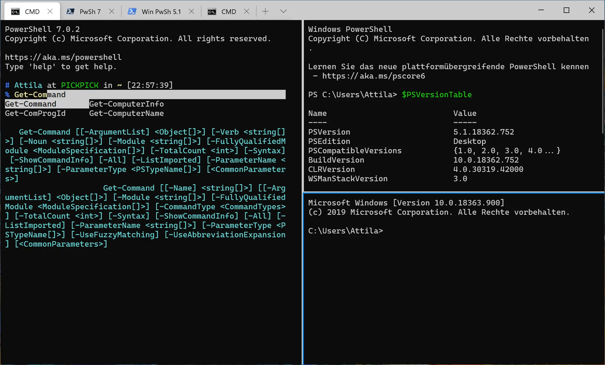

## Welche Frage beantwortet dieser Artikel?

Dieser Artikel beantwortet eine konkrete Frage: **Wie richtest du PowerShell so ein, dass du vom ersten Tag an stabil und produktiv arbeiten kannst?**

> Stand: 2026-02  
> Getestet mit: PowerShell 7.5 (`pwsh`), VS Code und Windows Terminal unter Windows 11.

## 1) PowerShell 7 installieren

Windows PowerShell 5.1 ist oft bereits vorhanden, für neue Automatisierung ist aber PowerShell 7 die bessere Basis.

- Download: [PowerShell Releases](https://github.com/PowerShell/PowerShell/releases)
- passende `.msi` auswählen (zum Beispiel `win-x64`)
- Installation durchführen und `pwsh` starten

Version prüfen:

```powershell
$PSVersionTable.PSVersion
```

## 2) VS Code für PowerShell einrichten

VS Code ist der Standardeditor für PowerShell im professionellen Umfeld.

Empfohlenes Minimal-Setup:

- Erweiterung `PowerShell` von Microsoft installieren
- integriertes Terminal auf PowerShell setzen
- Formatierung beim Speichern aktivieren

```json
{
  "editor.formatOnSave": true,
  "terminal.integrated.defaultProfile.windows": "PowerShell"
}
```

## 3) Windows Terminal sinnvoll nutzen

Windows Terminal hilft, mehrere Shells sauber parallel zu betreiben.

- Tabs für PowerShell, CMD und [WSL](/glossar/#wsl-windows-subsystem-for-linux)
- schnelle Profilwechsel
- gute Lesbarkeit bei langen Sessions



Start über `wt`:

```powershell
wt
```

## 4) Erste Cmdlets direkt ausprobieren

```powershell
Get-Process |
    Sort-Object CPU -Descending |
    Select-Object -First 10 Name, Id, CPU
```

```powershell
Get-Service |
    Where-Object Status -eq Running |
    Select-Object Name, Status
```

[Cmdlets](/glossar/#cmdlet) folgen in der Regel dem Muster `Verb-Noun`, zum Beispiel `Get-Help`, `Set-Location`, `Start-Service`.

## 5) Erstes Skript erstellen und sicher ausführen

Beispielskript `system-check.ps1`:

```powershell
Get-ChildItem -Path C:\Windows -Directory
```

Zum Starten einzelner Zeilen in VS Code: `F8`, für den Debuglauf: `F5`.

Falls Skriptausführung blockiert ist:

```powershell
Set-ExecutionPolicy -ExecutionPolicy RemoteSigned -Scope CurrentUser
```

## Häufige Einsteigerfehler vermeiden

- zu früh mit großen Skripten starten statt mit kleinen, prüfbaren Schritten
- keine Versionsprüfung vor Supportfällen
- fehlende Fehlerbehandlung und kein Logging
- Befehle aus dem Internet ungeprüft übernehmen

## Weiterführende Inhalte

- [PowerShell verstehen]()
- [PowerShell-Hilfe richtig nutzen]()
- [PowerShell Cmdlets finden]()
- [PowerShell in VS Code produktiv einrichten]()
- [PowerShell sicher einsetzen]()
- [Leistungen]()
- [Kontakt]()

## Fazit

Mit PowerShell 7, VS Code und Windows Terminal steht deine Arbeitsumgebung auf einer stabilen Basis. Wenn Version, Editor und Ausführung sauber konfiguriert sind, wird der Einstieg deutlich schneller und spätere Automatisierung robuster.
